# Отчет по лабораторным работам 
**Выполнил:** Перелыгин Олег  
**Группа:** ЭВМб-23-1  

## Лабораторная работа 1
**Вариант 3:** Определить отношения: СЫН, ДОЧЬ, ОТЕЦ, МАТЬ, МУЖЧИНА и ЖЕНЩИНА.

### результаты
1. Поиск сыновей определенной матери:
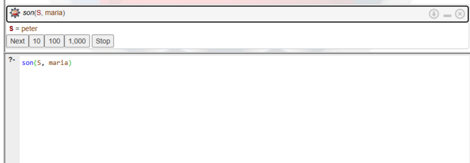

2. Поиск общих детей определенной пары родителей:
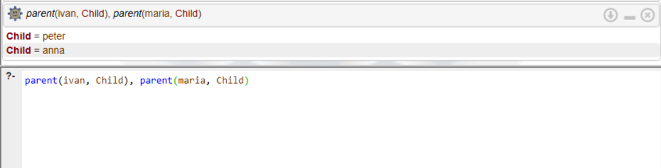

3. Поиск родителей человека:
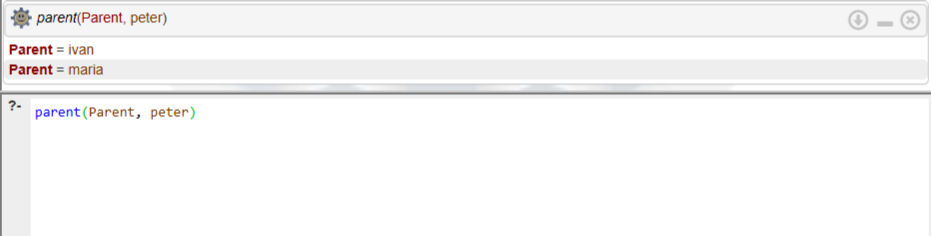

4. Проверка пола человека:
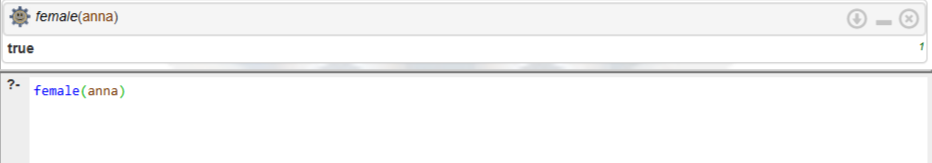

**Вывод:** Изучен базовый синтаксис языка Prolog. Освоено написание фактов и правил логического вывода для формализации связей.

## Лабораторная работа 2
**Вариант 5:** Сформировать новый список, в котором каждый элемент исходного списка входит в новый список два раза подряд.
**Вариант 13:** Заменить элемент списка на заданное значение.

 **(Вар 5)**
 
**Декларативная интерпретация:** Дублирование пустого списка дает пустой список. Дублирование непустого списка - это список, начинающийся с двух одинаковых элементов, за которыми следует продублированный хвост.  
**Процедурная интерпретация:** Программа берет голову исходного списка, добавляет её дважды в результирующий список и рекурсивно переходит к хвосту.

 **(Вар 13)**
 
**Декларативная интерпретация:** Замена элемента в пустом списке дает пустой список. Если элемент списка совпадает с заменяемым, в результат пишется новое значение. Иначе элемент переносится без изменений.  
**Процедурная интерпретация:** Программа поочередно проверяет элементы списка. При совпадении с искомым значением происходит подстановка, при несовпадении (`Old \= H`) элемент просто копируется, и вызывается рекурсия для хвоста.

### результаты
1. Дублирование элементов списка (Вар 5):
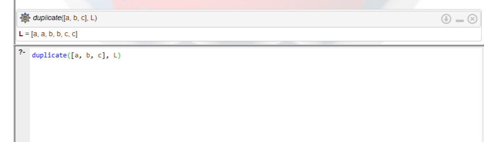

2. Обработка пустого списка (Вар 5):
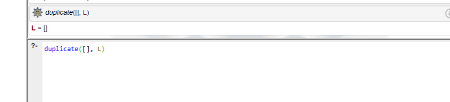

3. Замена существующих элементов (Вар 13):
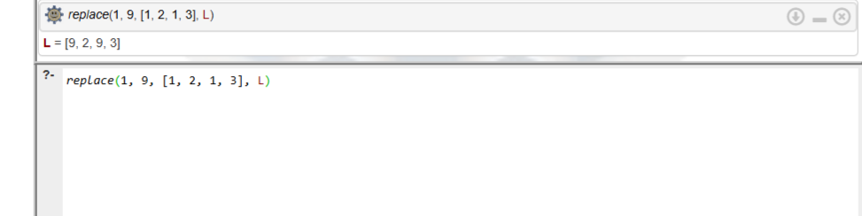

4. Попытка замены отсутствующего элемента (Вар 13):
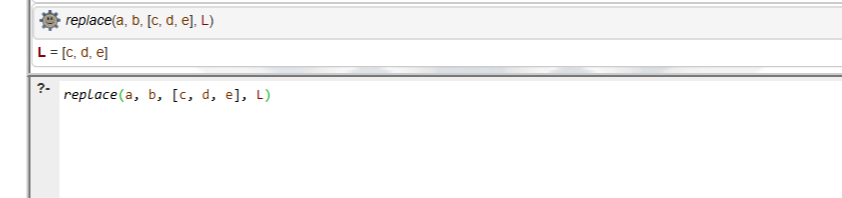

**Вывод:** Изучен механизм работы со списками и рекурсией в логическом программировании. Освоена модификация элементов списка и сопоставление с образцом (pattern matching)

## Лабораторная работа 3
**Вариант 12:** База данных "Ресторан" (Меню и блюда).

### результаты

1. Инициализация тестовой БД:

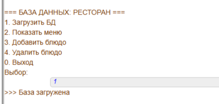

3. Вывод текущего меню:

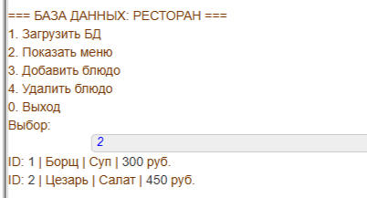

5. Добавление нового блюда:

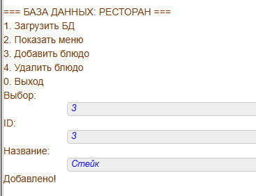

7. Удаление блюда из базы (с каскадным удалением связей):

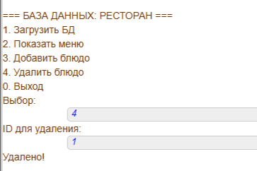

9. Выход из программы:
   
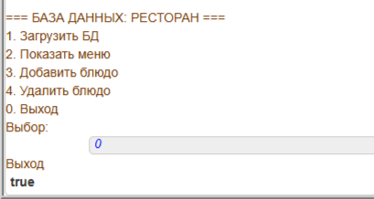

**Вывод:** Изучены встроенные предикаты для работы с динамической памятью (`assertz`, `retract`, `retractall`). Реализовано интерактивное меню пользователя.

## Лабораторная работа 4
**Вариант 2:** Решение диофантова уравнения `4x + 5y = 0` в диапазоне от -100 до 100.

### результаты
1. Поиск решений оптимизированным методом:
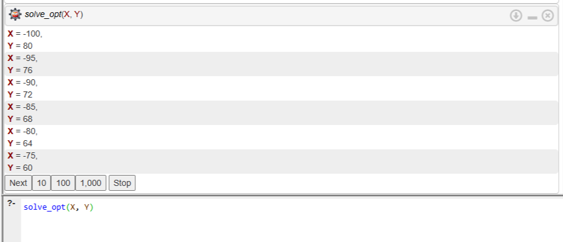

2. Замер трудоемкости полного (наивного) перебора:
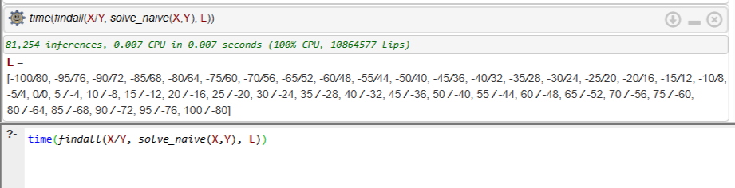

3. Замер трудоемкости оптимизированного перебора:
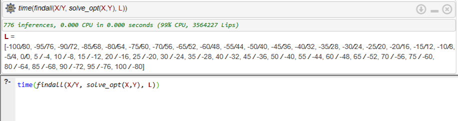

**Вывод:** За счет математической оптимизации (выражение одной переменной через другую) удалось значительно сократить пространство перебора, что подтверждается резким снижением количества логических операций (inferences).

## ЭС
**Задание:** Разработать экспертную систему прямого логического вывода на тему "Выбор видеоигры".

### результаты
1. Ветка 1 (Экшен -> Сетевая игра):
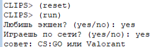

2. Ветка 2 (Экшен -> Одиночная игра):
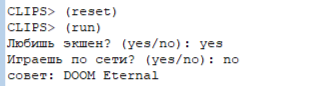

3. Ветка 3 (Без экшена -> Стратегия):
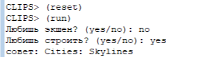

4. Ветка 4 (Без экшена -> РПГ):
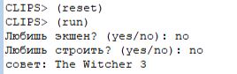

**Вывод:** Изучена среда разработки ЭС CLIPS. Освоен синтаксис правил (`defrule`) и механизм прямого вывода (forward chaining) для построения дерева принятия решений.
